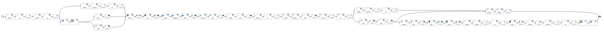
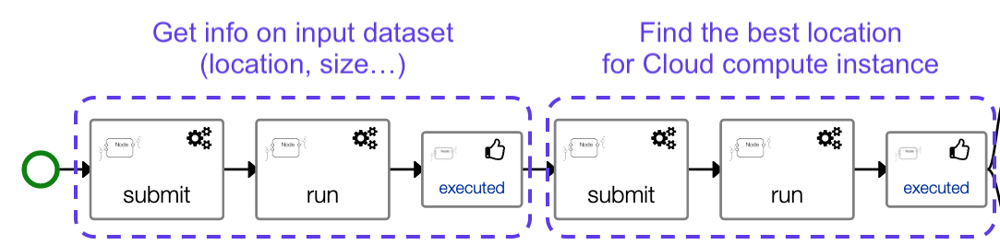
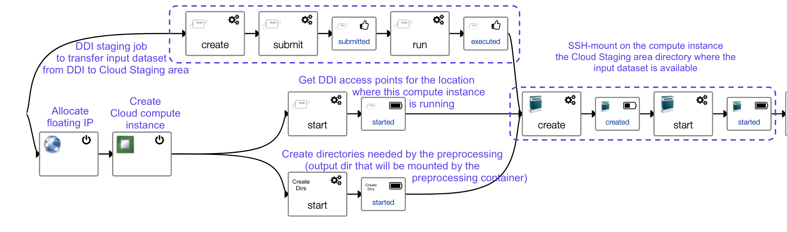
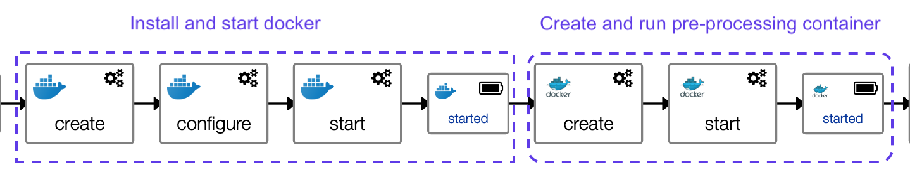
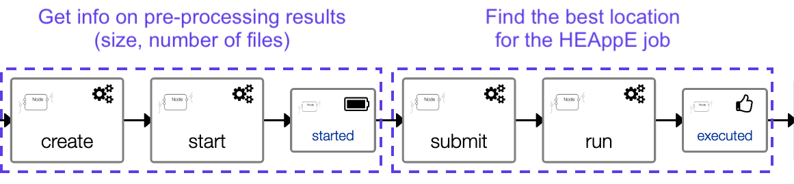
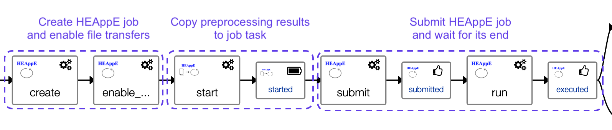
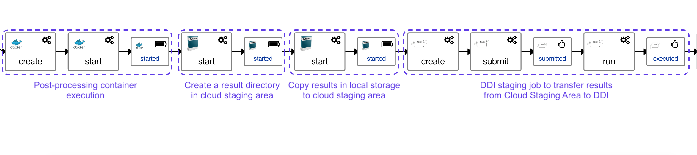
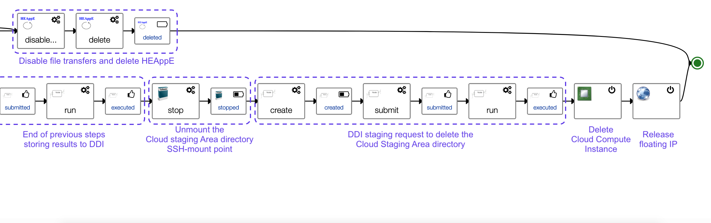

# LEXIS Template

Template of a generic LEXIS workflow, performing:
* the transfer of an input dataset from DDI to a Cloud Staging Area
* the pre-processing of these data, running a docker container on a cloud compute instance created on demand
* the transfer of pre-processing results to a HEAppE job that will perform a computation on a HPC cluster
* the transfer of HPC computation results to DDI
* the transfer of HPC computation results to the cloud compute instance local storage
* the post-processing of these computation results, running a post-processing docker container
* the transfer of post-processing results from the cloud instance local storage to the Cloud Staging Area
* the transfer of post-processing results from the Cloud Staging Area to DDI
* the replication these results to other sites if specified

See TOSCA code in [lexis_template.yaml](lexis_template.yaml).

A graphical view of the template topology shows:
* a Compute Instance hosting software that will perform the pre-processing and
  post-processing computation
* DDI jobs that will perform the necessary data transfers between the infrastructures
* a HPC Job that will perform the computation on the HPC infrastructure 
* Dynamic orchestration components computing the best infrastructure to use

This application template is providing a `Run` workflow, which is by convention in LEXIS,
the workflow that will be executed by LEXIS Portal.

A graphical view of this workflow shows:

Zooming on each sequence of this workflow, it first starts by gathering info on the
input dataset available in DDI: its size, in which locations it is available (LRZ, IT4I, or both locations),
needed to evaluate the cost of a data transfer.
Then, submits the job `FindCloudLocationJob` seen above in the template topology,
that will compute the best Cloud location taking into account:
* info on this input dataset to transfer to a Cloud staging area
* the requirements of the Cloud Compute instance associated to the component FindCloudLocationJob
* the availability of Computing resources on the different LEXIS Cloud locations.

Then, the workflow creates a Cloud compute instance on the selected location, and transfers
the input dataset from DDI to make it available to this cloud compute instance:

Then the docker service is installed and started, and the pre-processing container is run:

Once the container has run and produced results, a component `GetPreprocessDatasetInfo` is
started to provide details on these pre-processing results (size, number of files...),
needed to evaluate the cost of a data transfer.
And the job `FindHPCLocationJob` is submitted to find the best HPC location where to
run next HPC computation job:

Then, a HEAppE job is first created on the selected HPC location, and File transfers
are then enabled on it, so that the next step can copy pre-processing results to
the HEAppE job task.
The orchestrator submits then the HEAppE job and waits for its end.

Once the HEAppE job has been executed, two branches of the workflow are executed in parallel:
* the transfer of HPC job task results to DDI
* the transfer of HPC job task results to the compute instance for post-processing

The post-processing container is then run, its results are copied to the Cloud
Staging Area, then staged to DDI:

The computation is now done, the final phase is a cleanup phase where infrastructure
resources that were allocated for the computation are now released.
Two branches run in parallel on the workflow:
* the branch excuted after the transfer of HPC job results, taking care of deleting the job
* the branch executed after the post-processing, taking care of cleaning up the Cloud Staging area
  and deleting Cloud compute resources.

## Input properties

The template expects the following input properties (mandatory inputs in **bold**):
* **token**: OpenID Connect access token
* **project_id**: LEXIS project identifier
* **preprocessing_dataset_path_input_path**: Dataset containing input data
* **preprocessing_container_image**: Preprocessing container repository path
  * for example: `laurentg/lexistest:1.2` (see corresponding [Dockerfile](../cloudHPCComputation/Dockerfile))
* **computation_heappe_command_template_name**: HEAppE Command Template Name
* **postprocessing_container_image**:
  * for example: `laurentg/lexistest:1.2` (see corresponding [Dockerfile](../cloudHPCComputation/Dockerfile))
* **postprocessing_ddi_project_path**: Path where to transfer the post-processing results in DDI
* preprocessing_decrypt_dataset_input: Should the input dataset be decrypted
  * default: `false`
* preprocessing_uncompress_dataset_input: The input dataset be uncompressed
  * default: `false`
* preprocessing_mount_point_input_dataset: Directory on the compute instance where to mount the dataset
      default: `/mnt/lexis_test`
* preprocessing_container_env_vars: Preprocessing container environment variables
  * default:
    * INPUT_DIR: "/input_dataset"
    * RESULT_DIR: "/output"
    * RESULT_FILE_NAME: "preprocessing_result.txt"
* preprocessing_container_volumes: List of volumes to mount within the preprocessing container. Use docker CLI-style syntax: /host:/container[:mode]
  * default:
    * "/mnt/lexis_test:/input_dataset"
    * "/lexistest/output:/output"
* preprocessing_output_directory: Preprocessing output directory
  * default: "/lexistest/output"
* computation_heappe_command_template_name: HEAppE Command Template Name
  * default: `GenericCommandTemplate`
* computation_heappe_job: Description of the HEAppE job/tasks
  * default:
    * Name: `GenericJob`
    * Project: `Set by orchestrator`
    * ClusterId: `1`
    * Tasks:
      * Name: `GenericCommandTemplate`
      * ClusterNodeTypeId: `1`
      * CommandTemplateId: `1`
      * TemplateParameterValues:
        * CommandParameterIdentifier: `userScriptPath`
          ParameterValue: ``
      * WalltimeLimit: `3600`
      * MinCores: `1`
      * MaxCores: `1`
      * Priority: `4`
      * StandardOutputFile: `stdout`
      * StandardErrorFile: `stderr`
      * ProgressFile: `stdprog`
      * LogFile: `stdlog`
* computation_hpc_subdirectory_to_stage: Relative path to a subddirectoy on the HPC job cluster file system, to stage
  * default: `""`
* computation_metadata_dataset_result: Metadata for the Computation results dataset to create in DDI
  * default:
    * creator:
      * `LEXIS worflow`
    * contributor:
      * `LEXIS worflow`
    * publisher:
      * `LEXIS worflow`
    * resourceType: `Dataset`
    * title: `LEXIS computation results`
* postprocessing_container_env_vars: Postprocessing container environment variables
  * default:
    * `INPUT_DIR: "/input_dataset"`
    * `RESULT_DIR: "/output"`
    * `RESULT_FILE_NAME: "postprocessing_result.txt"`
* postprocessing_container_volumes: List of volumes to mount within the postprocessing container. Use docker CLI-style syntax: /host:/container[:mode]
  * default:
    * `/input_computation_results:/input_dataset`
    * `/output_postprocessing:/output`
* postprocessing_input_directory: Postprocessing input directory
  * default: `/input_computation_results`
* postprocessing_output_directory: Postprocessing output directory
  * default: `/output_postprocessing`
* postprocessing_metadata_dataset_result: Metadata for the postprocessing results dataset to create in DDI
  * default:
    * creator:
      * `LEXIS worflow`
    * contributor:
      * `LEXIS worflow`
    * publisher:
      * `LEXIS worflow`
    * resourceType: "Dataset"
    * title: "LEXIS workflow results"
* postprocessing_encrypt_dataset_result: Encrypt the result dataset
  * default: `false`
* postprocessing_compress_dataset_result: Compress the result dataset
  * default: `false`
* postprocessing_result_dataset_replication_sites: List of sites where the result dataset should be available - WARNING: a replicated dataset can't be deleted - (example of values: it4i, lrz)
  * default: []

## Ouput attribute

The following output attribute is provided:
* attribute `destination_path` of component `HPCToDDIJob`: DDI path to HPC results
* attribute `destination_path` of component `CloudToDDIJob`: DDI path to post-processing results

