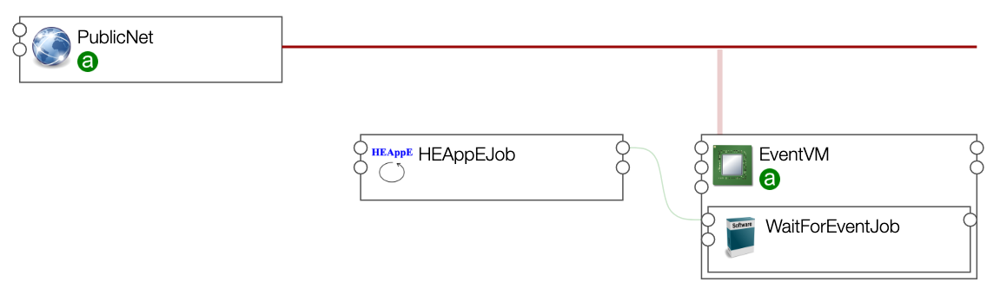
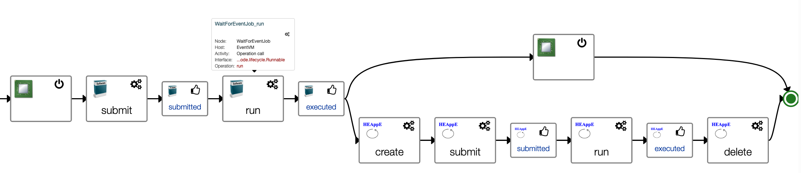
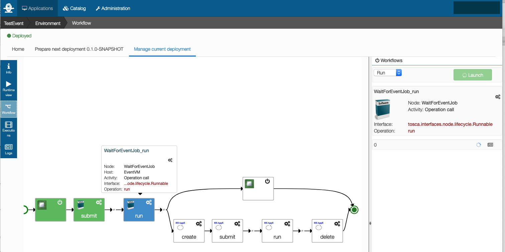

# Example of workflow triggered on event

In the case when a workflow execution needs to be triggered by an event,
it is possible to implement the waiting for the event in the workflow itself, as
a pre-processing phase.

This example implements such a workflow, with :
* a preprocessing phase, where a program waiting for an event is run on a cloud compute instance as a job,
  this job will be finished only when an event is received
* a computation phase, starting after the pre-processing phase, where a HEAppE job is run on a HPC cluster.

A graphical view of the application template shows:
* a cloud compute instance `EventVM`
* a component `WaitForEventJob` run on this compute instance, that will wait for an event
* a HEAppE job



For this example, the progran launched by the job `WaitForEventJob` to wait for an event is
a script avaiable at [../../components/events/scripts/wait_and_get_file_content.sh](../../components/events/scripts/wait_and_get_file_content.sh).
It loops on downloading a file from a URL provided by the user in input of the Application,
until the file is not empty. When the file is not empty, the script prints it content and exits.
The job `WaitForEventJob`, that submitted the execution of this script, will then be done.

This application template is providing a `Run` workflow that will:

  * create the cloud compute instance `EventVM`
  * submit the job `WaitForEventJob` that will run a program on this compute instance to wait for an event
  * monitor the job execution:
    * this job will be running while the event is not received (workflow step `run` in the mage below)
    * the job will be completed when an event is received
  * once the job `WaitForEventJob` is completed, ie. once an event was received, the workflow executes in parallel:
    * the deletion of the cloud compute instance `EventVM`
    * the submission and monitoring og a HEAppE job on a HPC cluster

A graphical view of this workflow shows:



The following sections describe how to create this application and run the workflow from the CLI,
using commands provided in the [Alien4Cloud Go Client library](https://github.com/alien4cloud/alien4cloud-go-client).

1. [Get commands allowing to perform CLI operations](#event_get_cli)
2. [Upload TOSCA components and application template in Alien4Cloud catalog](#event_upload_tosca)
3. [Create the application](#event_create_app)
4. [Set the input parameter](#event_setinput)
5. [Deploy the application](#event_deploy_app)
6. [Run the workflow](#event_run_wf)
7. [Undeploy the Application](#event_undeploy_app)

## <a name="event_get_cli"></a>Get commands allowing to perform CLI operations

To ease the use Alien4Cloud REST API, commands are provided by the [Alien4Cloud Go Client library](https://github.com/alien4cloud/alien4cloud-go-client).
To download them, do:

```bash
cd §HOME
curl -o commands.zip -L https://github.com/alien4cloud/alien4cloud-go-client/releases/download/v3.0.0-milestone.2/commands.zip
unzip commands.zip
chmod u+x *
```
It provides these commands we will use below:
* `upload` to upload a zipped TOSCA component to the Alien4Cloud catalog
* `create` to create an application from a given template available in catalog
* `setinput` to set an input parameter of the application (here the URL used by our program waiting for an event)
* `deploy` to deploy the application from Alien4Cloud to the backend orchestrator Yorc
* `run` to run a workflow
* `undeploy` to undeploy and delete the application.

## <a name="event_upload_tosca"></a>Upload TOSCA components and application template in Alien4Cloud catalog

First clone this repository:

```bash
git clone https://github.com/lexis-project/application-templates.git
```

Then, upload in Alien4Cloud catalog, a first component which is a generic component allowing to manage jobs without a scheduler.
So, it allows to run a program as a job (first submitted, then monitored by the orchestrator to check its status, until it completes)
on a cloud compute instance.

First, prepare the archive by zipping TOSCA components files.
The archive is called a CSAR (Cloud Service ARchive) in Alien4Cloud terminology.

```bash
cd application-templates/common/noscheduler_job
zip -r $HOME/csar-lexis-common-noschedjob.zip *
```

Then upload this archive in Alien4Cloud catalog, providing in argument:
* the Alien4Cloud URL
* a user who has the role `Admin` or `Architect` so that he is allowed to upload components in the catalog
* the corresponding password
* the path to the archive to upload

```bash
$HOME/upload -url https://1.2.3.4:8088 \
         -user myuser \
         -password mypasswd \
         -csar $HOME/csar-lexis-common-noschedjob.zip
```

It will display the message:
```
CSAR uploaded!
```
and will provide details about the archive uploaded.

Then, upload the archive describing the TOSCA component `WaitForEventJob`,
which inherits from the generic 'no scheduler job' uploaed above and define a submit operation
that will launch our program [../../components/events/scripts/wait_and_get_file_content.sh](../../components/events/scripts/wait_and_get_file_content.sh).

```bash
cd ../../examples/components/events
zip -r $HOME//csar-lexis-components-events.zip *
$HOME/upload -url https://1.2.3.4:8088 \
         -user myuser \
         -password mypasswd \
         -csar $HOME/csar-lexis-components-events.zip
```

Then, upload the application template in Alien4Cloud catalog.

```bash
cd ../../applications/eventTrigger
zip -r /Users/laurentganne/dev/go/src/github.com/ystia/csar/csar-event-trigger-app.zip event_trigger_template.yaml
$HOME/upload -url https://1.2.3.4:8088 \
         -user myuser \
         -password mypasswd \
         -csar $HOME/csar-event-trigger-app.zip
```

All components are now uploaded in Alien4Cloud catalog,
you are ready to create the application.

## <a name="event_create_app"></a>Create the application

The Application template we uploaded in Alien4Cloud catalog is named `EventTriggerTemplate`.
Create an application named `TestEvent`, running this command:

```bash
$HOME/create -url https://1.2.3.4:8088 \
             -user myuser \
             -password mypasswd \
             -app TestEvent \
             -template EventTriggerTemplate
```

## <a name="event_setinput"></a>Set the input parameter

Our application has an input parameter, for which it is mandatory to set a value
before being able to deploy the application.
This input parameter is named `preprocessing_event_file_url`. It will be used by
our program looping on getting this file until this file is not empty.
Here we set this value to the URL of a file in a given repository used for tests.

```bash
$HOME/setinput -url https://1.2.3.4:8088 \
               -user myuser \
               -password mypasswd \
               -app TestEvent \
               -property preprocessing_event_file_url  \
               -value https://code.it4i.cz/gan0035/artifacts/-/raw/master/event.txt
```

Now that this required input parameter has a value, the application can be deployed

## <a name="event_deploy_app"></a>Deploy the application

Deploying the application will transfer it from Alien4Cloud to the backend orchestrator Yorc,
and will execute the `install` workflow. In our implementation of this application,
the `install` workflow here is just allocating an IP adress on the public network.

```bash
$HOME/deploy url https://1.2.3.4:8088 \
               -user myuser \
               -password mypasswd \
               -app TestEvent
```

On sucess, it should display this output: the deployment status, and a variable `stdout`
not yet set for now, that will show the event received once we will have run the next workflow below.

```
Deployment status: DEPLOYED

Outputs:
 - WaitForEventJob
  * stdout: 
```

## <a name="event_run_wf"></a>Run the workflow

By convention beween LEXIS Portal and the orchestration service, the workflow
to be executed by the Portal is named `Run`.

To execute this workflow, run this command :

```bash
$HOME/run -url https://1.2.3.4:8088 \
          -user myuser \
          -password mypasswd \
          -app TestEvent \
          -workflow Run
```

It will first create a cloud compute instance, then submit the job `WaitForEventJob`,
then will monitor the status of the job which will be seen as running while no event is received.
So in our case in this example, the job will be seen as running while the file at the URL provided in input is empty.

Logs appear on the CLI every n seconds; and show the job is still in state `RUNNING`:

```
2020/11/12 14:39:46 2020-11-12T14:39:44Z [yorc-TestEvent-Environment][DEBUG][Run][WaitForEventJob][][tosca.interfaces.node.lifecycle.runnable][run] got job status "RUNNING", error: <nil>
```

On the Alien4Cloud UI, the workflow appears this way.
Steps completed appear in green, steps currently running appear in blue:



If you update the file at the URL to add some content to it, after a few seconds,
the job should appear as done, and the workflow will continue.
In our implementation, the workflow will in parallel delete the cloud compute instance,
and submit/monitor a HEAppE job on a HPC cluster.

## <a name="event_undeploy_app"></a>Undeploy the application

Finally, when the `Run` workflow is finished, you can undeploy and delete the application:

```bash
$HOME/undeploy -url https://1.2.3.4:8088 \
               -user myuser \
               -password mypasswd \
               -app TestEvent \
               -delete
```
