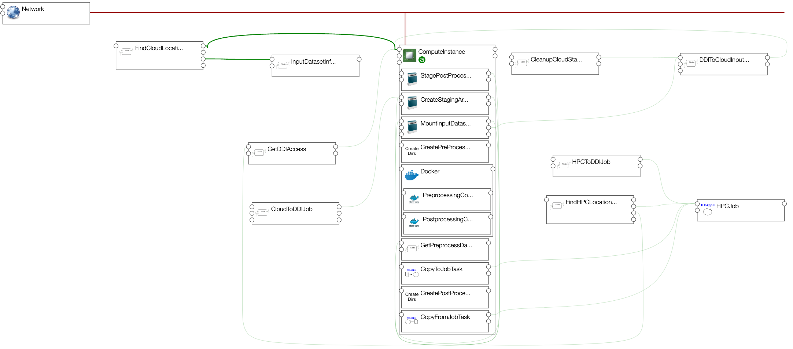
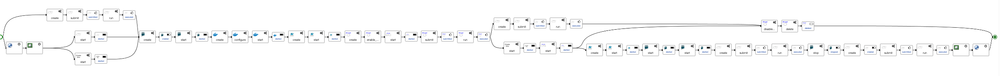

# Application Template sample

Example of application template that can be zipped and uploaded to an Alien4Cloud
catalog.

This example requires the user to provide in input a zip of his dataset.

This dataset will be provided in input of a job that will be submitted using HEAppE.

Once the job is done, a Virtual Machine will be created, docker will be installed on it,
job results will be copied on this Virtual Machine, and an Apache httpd docker container
 will be started.

A graphical view of the application template shows:

This application template is providing an `install` workflow that will:
  * create a HEAppE job (component TestJob above)
  * allocate a floating IP address on an OpenStack location.

This workflow is automatically executed at application deployment time.

The application template is also providing a `run` workflow executed on user demand,
that will:
  * copy the dataset to the HEAppe Job inputs directory on the IT4I HPC cluster (component Dataset above)
  * submit the HEAppE job (component TestJob above) created on IT4I cluster
  * wait for its end
  * get job results (component Results above)
  * create a Virtual Machine on OpenStack in LRZ (component VirtualMachine)
  * install and start Docker on this Virtual Machine (component Docker hosted on the VirtualMachine)
  * copy job results on this Virtual Machine (component CopyResults hosted on the VirtualMachine)
  * start an Apache httpd container (Component Apache hosted o the Component Docker)

A graphical view of this workflow shows:

This TOSCA application template is using TOSCA components provided by the Yorc 
HEAppE plugin (components of type org.heappe.*).
It is also using Docker and container components provided by the Ystia forge at
https://github.com/ystia/forge/tree/develop/org/ystia/docker
