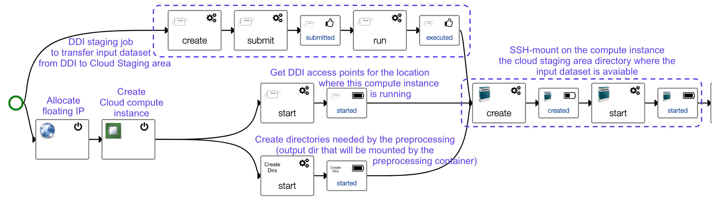
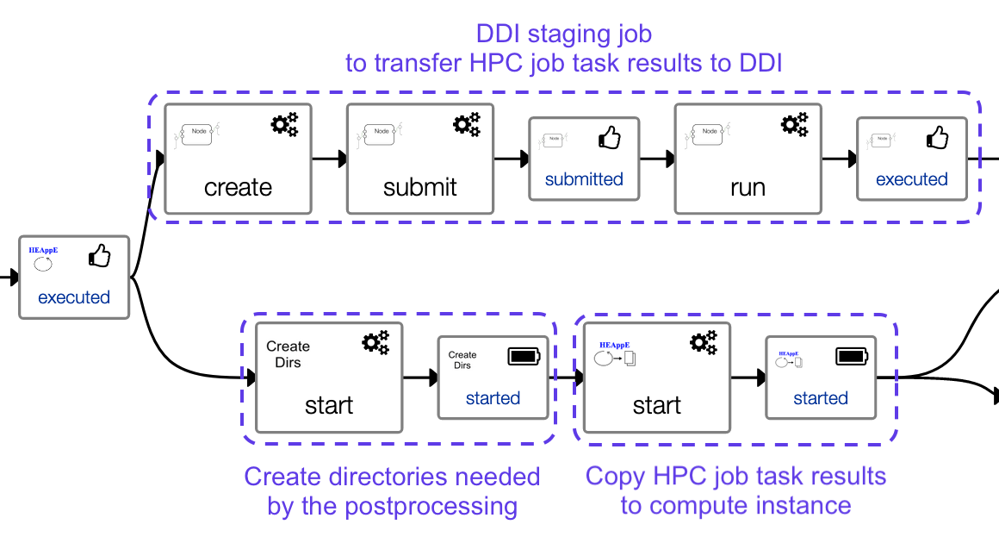

# LEXIS Template

Template for a generic LEXIS workflow implementation, performing:
* the transfer of an input dataset from DDI to a Cloud Staging Area
* the preprocessing of these data, running a docker container on a cloud compute instance created on demand
* the transfer of preprocessing results to a HEAppE job that will perform a computation on a HPC cluster
* the transfer of HPC computation results to DDI
* the transfer of HPC computation results to the cloud compute instance local storage
* the postprocessing of these computation results, running a postprocessing docker container
* the transfer of postprocessing results from the cloud instance local storage to the Cloud Staging Area
* the transfer of postprocessing results from the Cloud Staging Area to DDI

A graphical view of the template topology shows:

This application template is providing a `Run` workflow, which is by convention in LEXIS,
the workflow that will be executed by LEXIS Portal.

A graphical view of this workflow shows:

Zooming on each sequence of this workflow, it first starts by creating a cloud
compute instance, and transferring an input dataset from DDI to make it available to this cloud compute instance:

Then the docker service is installed and started, and the pre-processing container is run:

Once the container has run and produced results, a HEAppE job is first created
and File transfers are then enabled on it, so that the next step can copy
preprocessing results to the HEAppE job task.
The orchestrator submits then the HEAppE job and waits for its end.

Once the HEAppE job has been executed, two branches of the workflow are executed in parallel:
* the transfer of HPC job task results to DDI
* the transfer of HPC job task results to the compute instance for post-processing

The post-processing container is then run, its results are copied to the Cloud
Staging Area, then staged to DDI:

The computation is now done, the final phase is a cleanup phase where infrastructure
resources that were allocated for the computation are now released.
Two branches run in parallel on the workflow:
* the branch excuted after the transfer of HPC job results, taking care of deleting the job
* the branch executed after the post-processing, taking care of cleaning up the Cloud Staging are
  and deleting Cloud compute resources.

This TOSCA application template is using TOSCA components provided by the Yorc 
HEAppE plugin (components of type org.heappe.*).
It is also using Docker and container components provided by the Ystia forge at
https://github.com/ystia/forge/tree/develop/org/ystia/docker
