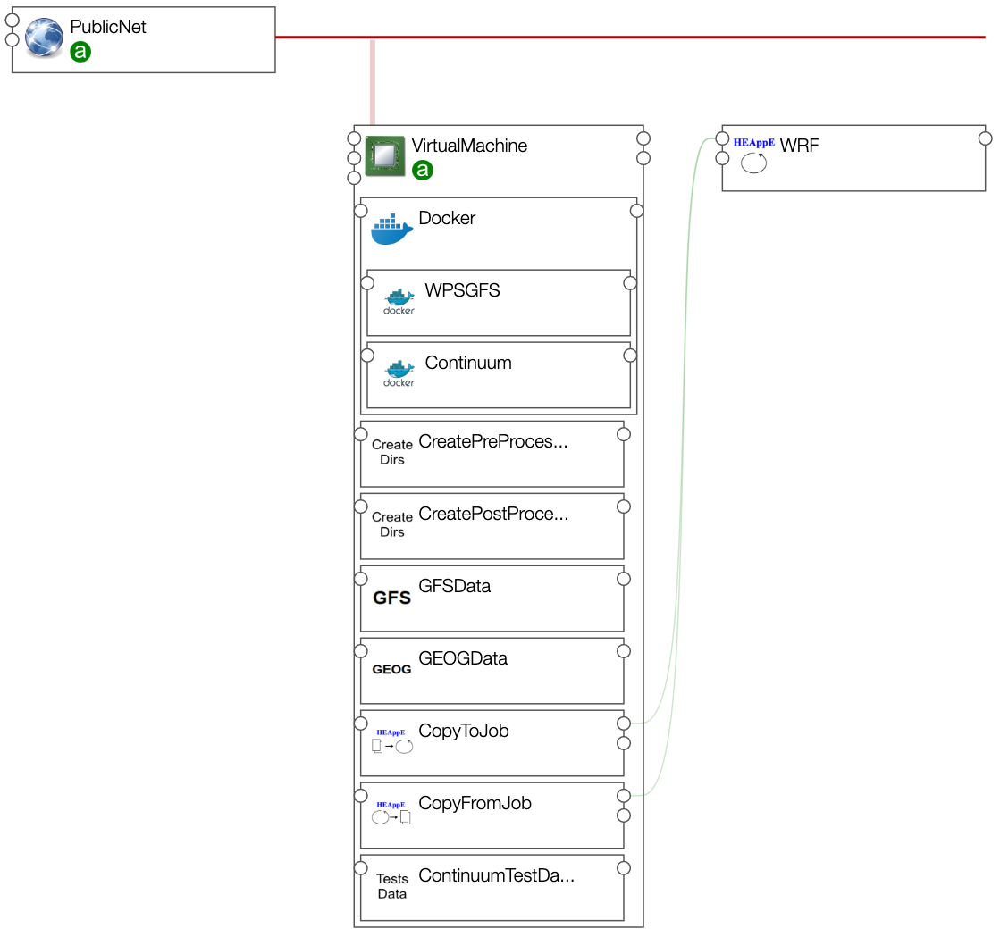
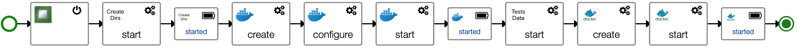
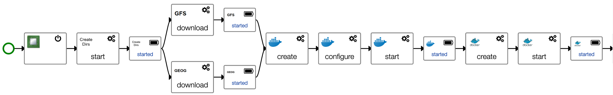
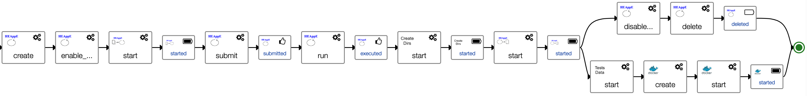

# Continuum Application Template

First draft for Continuum application template.
The graphical view of the application template shows the following components hosted
on a Virtual Machine:

* Docker, to run containers
* WFSGFS, container performing the pre-processing (see [CIMA WPS model](https://github.com/cima-lexis/wps.docker))
* Continuum, container performing the post-processing (see [CIMA FloodProofs](https://github.com/cima-lexis/fp-docker))
* CreatePreProcessDirs, component creating directories expected by the pre-processing container
* CreatePostProcessDirs, component creating directories expected by post-processing container
* GFSData, component downloading Global Forecast System files from a web site
* GEOGData, component downloading geographical files from a web site
* CopyToJob, component copying pre-processing results to a Job input directory
* CopyFromJob, component copying Job computation results to the compute instance
* ContinuumTestData, component downloading tests data used by the post-processing container

And a job:

* WRF, HEAppE Job performing a computation on the HPC infrastructure    

A workflow named `RunContinuumWithTestData` provides a simplified version of the
final `Run` workflow already implemented here, but that will require a new
Continuum post-processing container able to manage HEAppE job WRF results.

This workflow `RunContinuumWithTestData` creates first a Virtual Machine.
Next step creates directories that will be mounted in the post-processing container.
Next step installs and start Docker on this Virtual Machine.
Next step download Test Data that will be used as input data by the post-processing container.
Next step creates and start the post-processing docker container.

The `Run` workflow runs the full workflow, from pre-processing to post-precessing.
It creates first a Virtual Machine.
Then downloads in parallel GFS and geographical data files.
Docker is then installed on the Virtual Machine and the WPS GFS pre-processing container is run.

Once done, the workflow goes on creating a HEAppE job on the HPC infrastructure.
Next step enables file transfers for this job.
Then, WPS GFS pre-processing results are copied to the job (component CopyToJob operation).
The Job is then submitted, and the orchestrator waits until it ends.
Once done, Job results are copied to the Virtual Machine (component CopyFromJob operation).
Finally, in parallel:
* file transfer is disabled for the job and the job is deleted
* Test data are fetched and the Continuum post-processing container is run.

