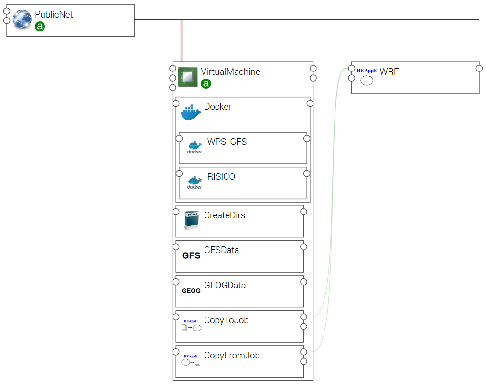
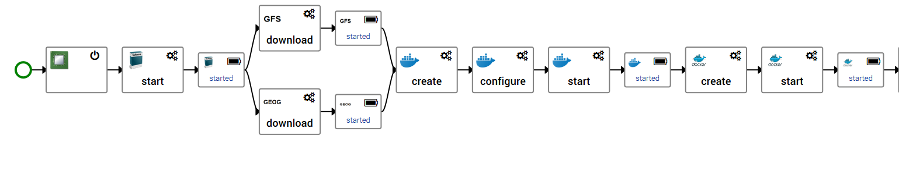
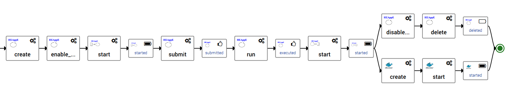

# RISICO application

First draft for RISICO application template.
The graphical view of the application template shows the following components hosted
on a Virtual Machine:

* Docker, to run containers
* WFS_GFS, container performing the pre-processing (see [CIMA WPS model](https://github.com/cima-lexis/wps.docker))
* RISICO, container performing the post-processing (see [CIMA RISICO model](https://github.com/cima-lexis/risico-docker))
* CreateDirs, component creating directories exepcted by containers
* GFSData, component downloading Global Forecast System files from a web site
* GEOGData, component downloading geographical files from a web site
* CopyToJob, component copying pre-processing results to a Job input directory
* CopyFromJob, component copying Job computation results to the compute instance
* WRF, HEAppE Job performing a computation on the HPC infrastructure    

The associated workflow creates first a Virtual Machine.
Then downloads in parallel GFS and geographical data files.
Docker is then installed on the Virtual Machine and the WPS GFS pre-processing container is run.

Once done, the workflow goes on creating a HEAppE job on the HPC infrastructure.
Next step, enables file transfers for this job.
Then, WPS GFS pre-processing results are copied to the job (component CopyToJob operation).
The Job is then submitted, and the orchestrator waits until it ends.
Once done, Job results are copied to the Virtual Machine (component CopyFromJob operation).
Finally, in parallel:
* file transfer is disabled for the job and the job is deleted
* RISICO post-processing container is run.

